# 🌱 GHADS — Gaza Humanitarian Aid Distribution System

A desktop application built in Java that helps humanitarian organizations in Gaza coordinate aid distribution for displaced families.

---

## 📌 System Purpose

GHADS solves a critical coordination problem: when multiple organizations work separately, the same family might receive aid multiple times while another family receives nothing. GHADS fixes this by maintaining **one shared database** for all organizations, ensuring fair and transparent distribution.

---

## 🚨 The Problem It Solves

During humanitarian crises, multiple NGOs and UN agencies operate independently — leading to:
- Duplicate aid going to the same families
- Other families receiving no aid at all
- No visibility into what other organizations have distributed

GHADS addresses this by:
- Registering every family **once** in a shared database
- **Automatically blocking duplicate distributions** within 30 days for MEDIUM/LOW vulnerability families
- Allowing coordinators from different organizations to see the full picture

---

## 🛠️ Technologies Used

| Technology | Purpose |
|---|---|
| Java | Core programming language |
| JavaFX + Scene Builder | Desktop UI framework |
| CSS | Styling and theming |
| MySQL | Relational database |
| JDBC | Database connectivity |

---

## 🏗️ Architecture Pattern

The project follows a multi-layered architecture combining:

- **MVC (Model - View - Controller)** — separates UI, logic, and data
- **DAO (Data Access Object)** — all database operations go through dedicated DAO classes
- **Singleton** — used for shared configuration (e.g., database connection)

```
src/
├── model/         # Data classes (User, Family, Organization, AidDistribution)
├── view/          # FXML files + CSS (built with Scene Builder)
├── controller/    # JavaFX controllers (handle UI events)
├── dao/           # Database access layer (JDBC queries)
└── util/          # Singleton config, helpers
```

---

## 👥 User Roles

### 🔴 Admin
- Manages organizations, users, and families system-wide
- Views all aid distributions across all organizations
- Full CRUD on all entities

### 🟢 Coordinator
- Belongs to one organization
- Registers families and records aid distributions
- The system runs automatic duplicate checks before saving any distribution

---

## ✅ Key Feature — Duplicate Check

Before saving any aid record, the system checks:

| Vulnerability Level | Received aid in last 30 days? | Result |
|---|---|---|
| HIGH | Yes | ✅ Allowed |
| MEDIUM | Yes (same aid type) | ❌ Rejected with alert |
| LOW | Yes (same aid type) | ❌ Rejected with alert |

---

## 🗄️ Database Schema

**4 main tables:** `Organization`, `User`, `Family`, `AidDistribution`

- `Organization` → has many `Users` and `AidDistributions`
- `User` → belongs to one `Organization`, has many `AidDistributions`
- `Family` → has many `AidDistributions`
- `AidDistribution` → links `Family` + `Organization` + `User` + `aid_type` + `date`

---

## 📸 Screenshots

### 🔐 Login
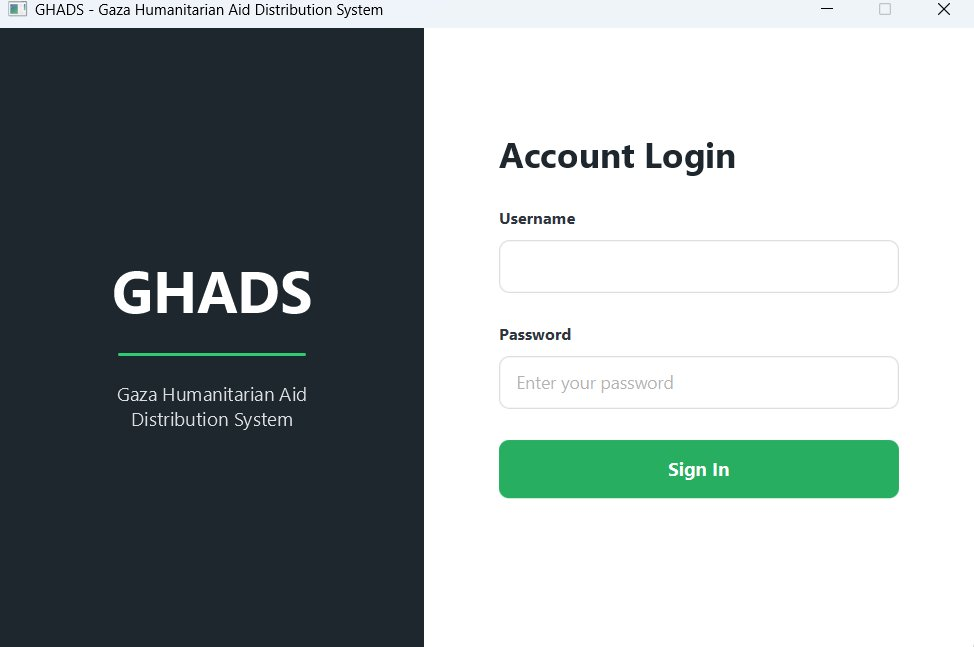

---

### 🏠 Admin Dashboard
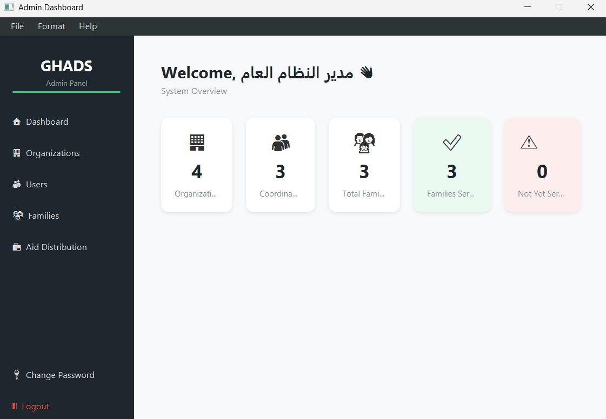

---

### 🏢 Organizations Management
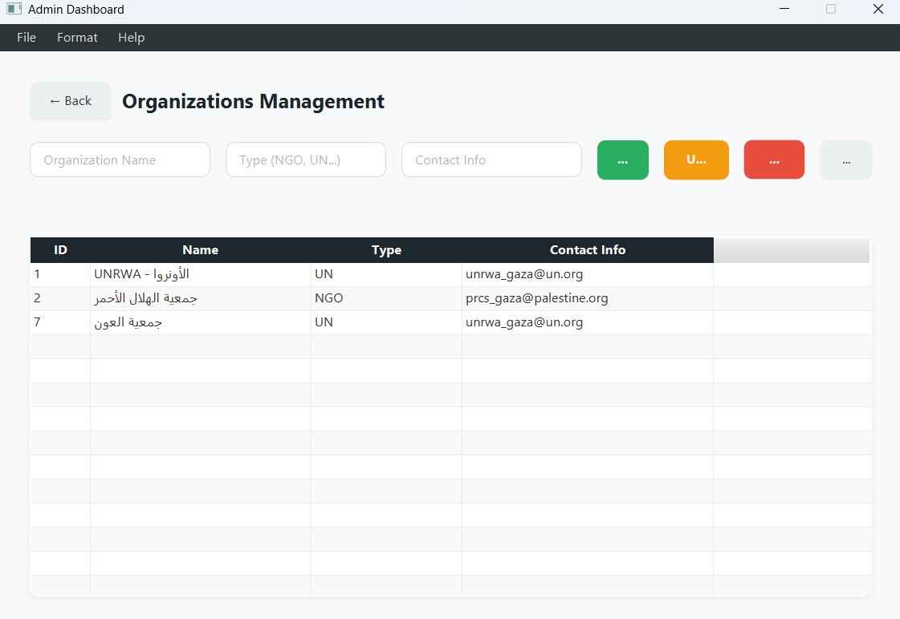

---

### 👤 Users Management


---

### 👤 Users Management — With Photo Upload
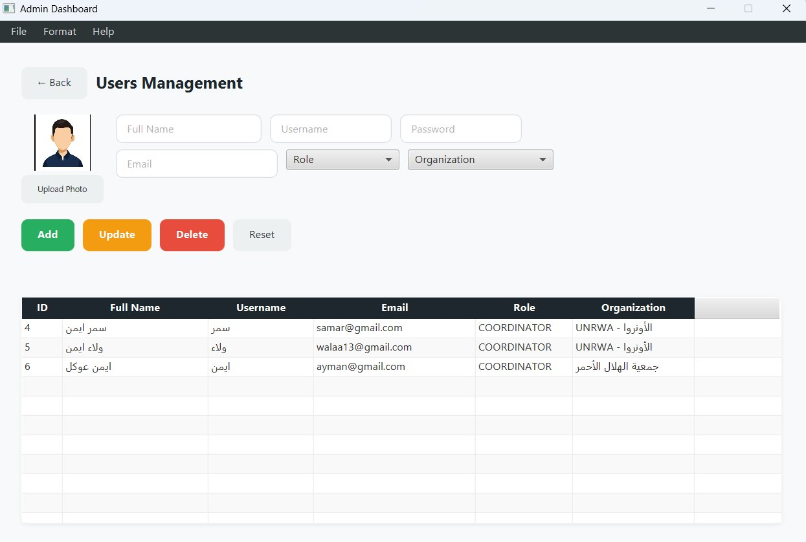

---

### 👨‍👩‍👧 Family Management (Admin)
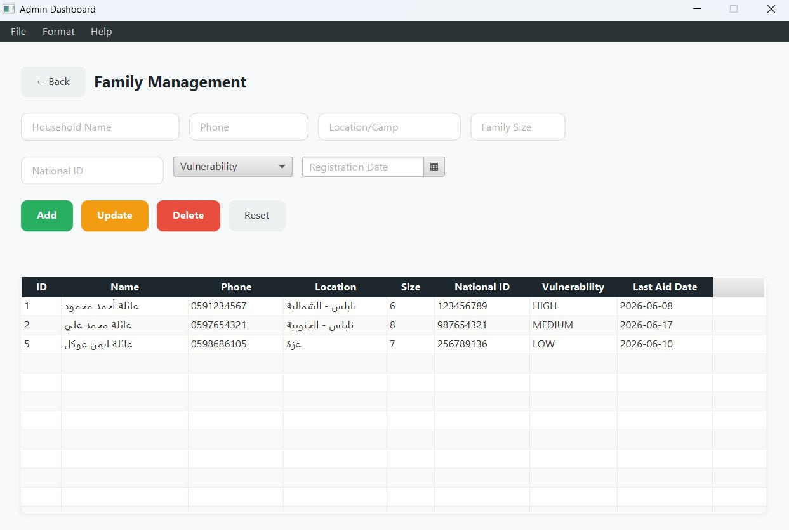

---

### 📦 Aid Distribution (Admin)
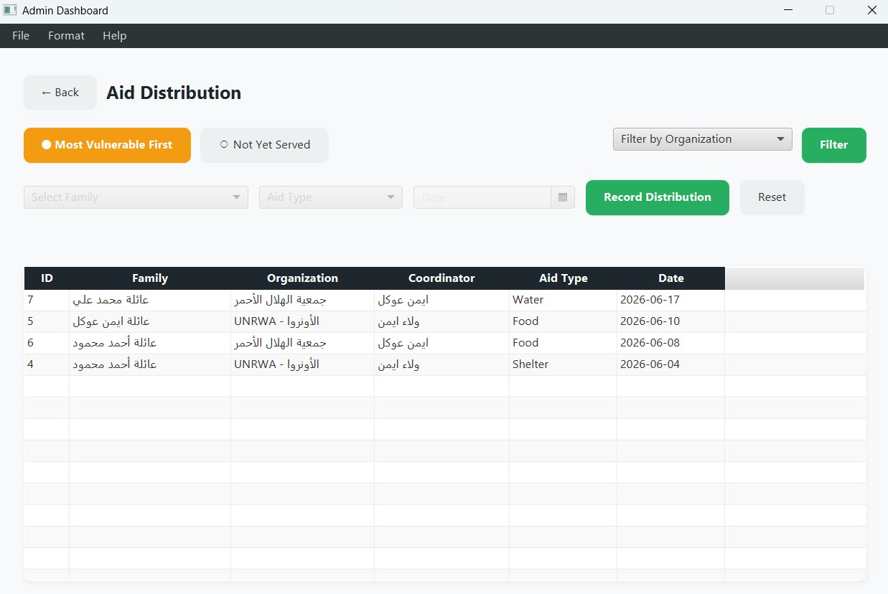

---

### 🔑 Change Password (Admin)
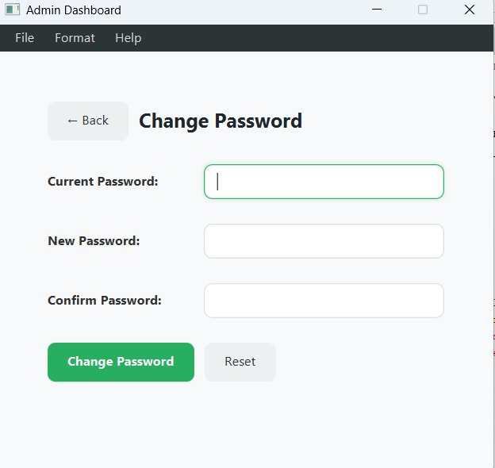

---

### ℹ️ About GHADS
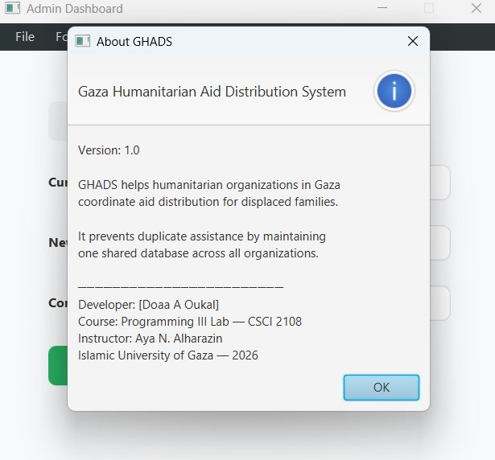

---

### 🏠 Coordinator Dashboard
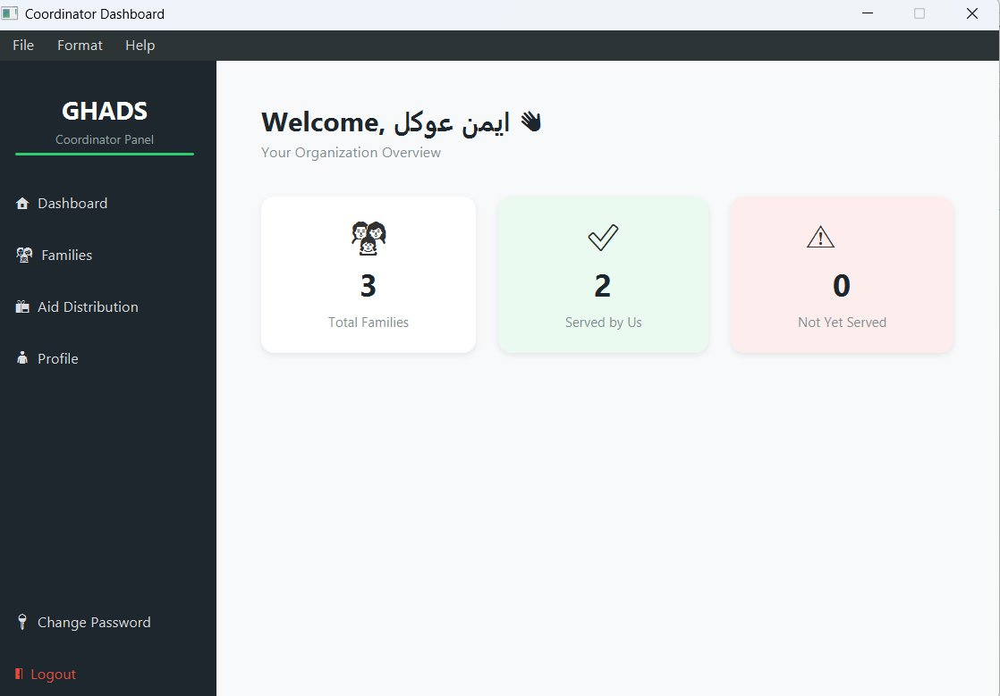

---

### 👨‍👩‍👧 Family Management (Coordinator)
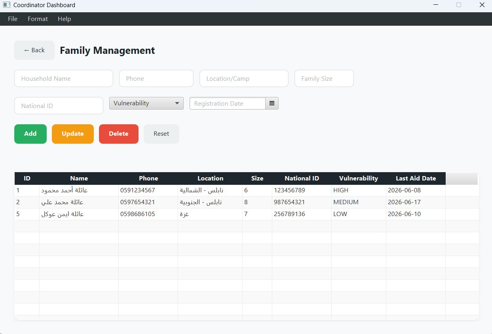

---

### 📦 Aid Distribution (Coordinator)
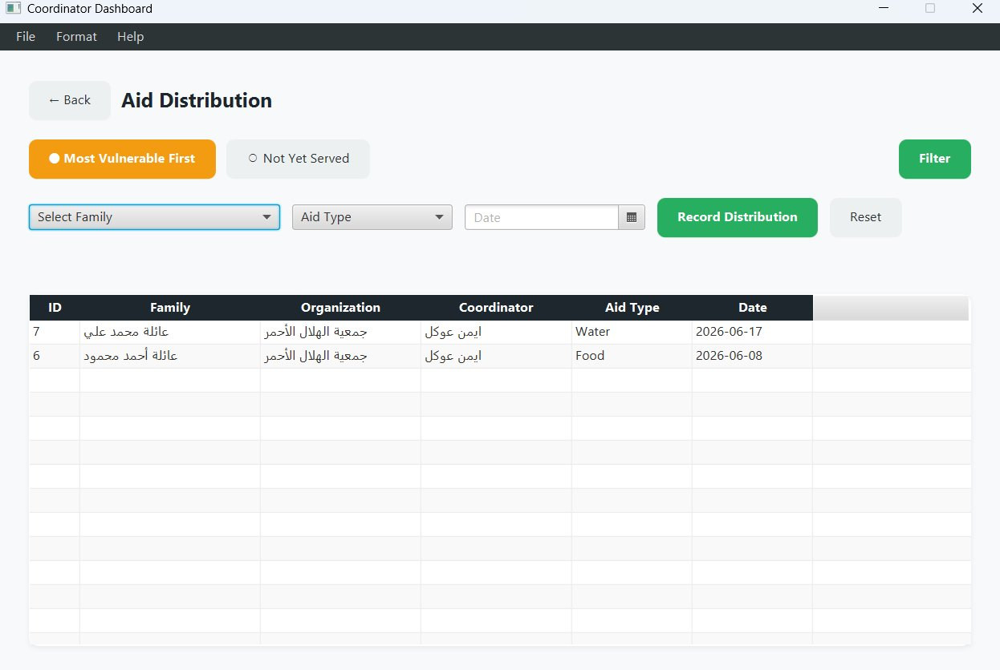

---

### 👤 My Profile
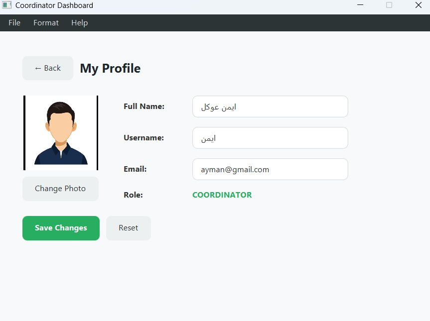

---

### 🔑 Change Password (Coordinator)
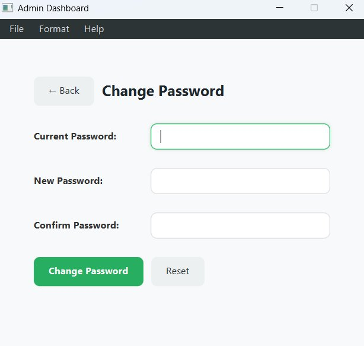

---

## 👩‍💻 Developer

**Doaa A Oukal**  
Course: Programming III Lab — CSCI 2108  
Instructor: Aya N. Alharazin  
Islamic University of Gaza — 2026

